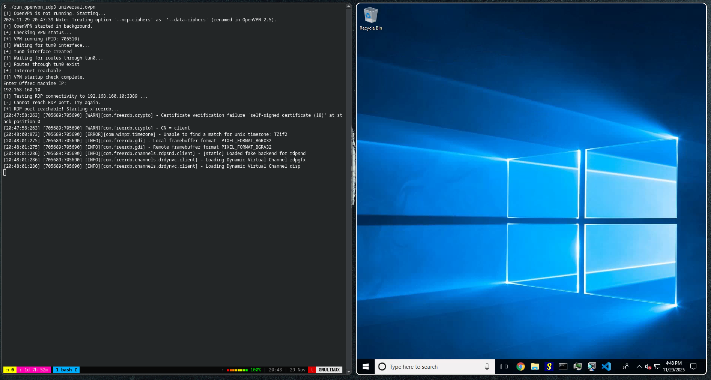

# run_openvpn_rdp3
Automated script that run for you openvpn and windows rdp from linux OS.

> Sometimes needs to run the script two or three times.


## Requirements
- Any Linux Distro
- `bash`
- `openvpn`
- `xfreerdp3`

## Clone The repo
```
git clone https://github.com/thxa/run_openvpn_rdp3.git
```

## Change permissions and run the openvpn
```sh 
chmod 755 run_openvpn_rdp3 
./run_openvpn_rdp3 universal.ovpn
```

## Add the RDP IP that you want connect to it

